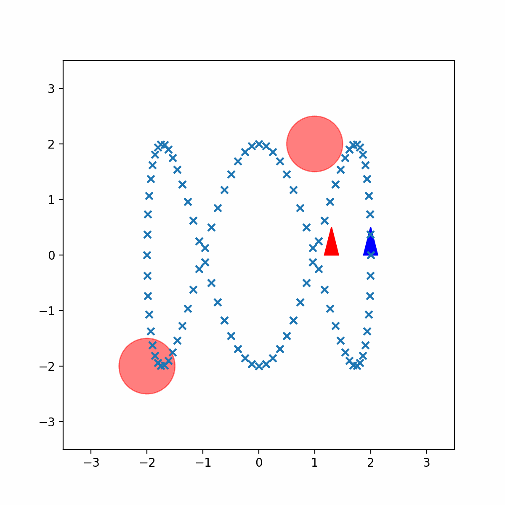

# Infinite-Horizon Stochastic Optimal Control for Differential-Drive Robots


This project implements **safe trajectory tracking** for a differential-drive ground robot using two methods:

* **Receding-Horizon Certainty Equivalent Control (CEC)**
* **Generalized Policy Iteration (GPI)**

Both controllers are designed to follow a reference trajectory while avoiding static obstacles and compensating for stochastic motion disturbances.

---


## Project Description

This repository is part of coursework for **ECE 276B: Planning & Learning in Robotics** at UCSD.
The problem is formulated as an **infinite-horizon discounted stochastic optimal control problem** for tracking under Gaussian motion noise.

Two controllers are implemented:

1. **CEC**

   * Solves a deterministic finite-horizon NLP at each step
   * Uses CasADi + IPOPT as the solver
   * Online re-optimization at every step
   * Provides smooth trajectories but ignores noise during optimization

2. **GPI**

   * Offline trains a policy on a discretized MDP
   * Uses tabular value iteration
   * Parallelized with Ray for scaling
   * Provides fast online execution and robustness to noise

---

## Simulation Setup

* Differential-drive robot
* Reference path: periodic curve with obstacles
* Obstacles:

  * Circle 1: center (-2, -2), radius 0.5
  * Circle 2: center (1, 2), radius 0.5
* Robot radius: 0.3

---

## How to Run

### Requirements

```bash
pip install -r requirements.txt
```

(You may manually install: `casadi`, `ray`, `mujoco`, `dm_control`, `matplotlib`, `numpy`)

### Run CEC controller:

```bash
python main.py --mode cec
```

### Run GPI controller:

```bash
python main.py --mode gpi
```

---

## File Structure

| File                | Description                                        |
| ------------------- | -------------------------------------------------- |
| `main.py`           | Main entry point (run CEC or GPI controller)       |
| `cec.py`            | CEC controller implementation using CasADi         |
| `gpi.py`            | GPI controller implementation with value iteration |
| `value_function.py` | Value function utilities                           |
| `mujoco_car.py`     | MuJoCo robot simulator interface                   |
| `utils.py`          | Helper functions (trajectory, visualization)       |
| `animation.gif`     | Example of trajectory tracking result              |

---

## Results Summary

| Method  | Total CPU Time (s) | Avg. Iter Time (ms) | Translation Error | Rotation Error |
| ------- | ------------------ | ------------------- | ----------------- | -------------- |
| **CEC** | 42.09              | 175.14              | 109.32            | 103.34         |
| **GPI** | 0.134              | 0.301               | 102.20            | 89.93          |

* **CEC**: smoother path but computationally heavy
* **GPI**: real-time control and better noise resilience, but choppier path due to discretization

---


